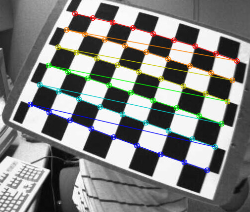
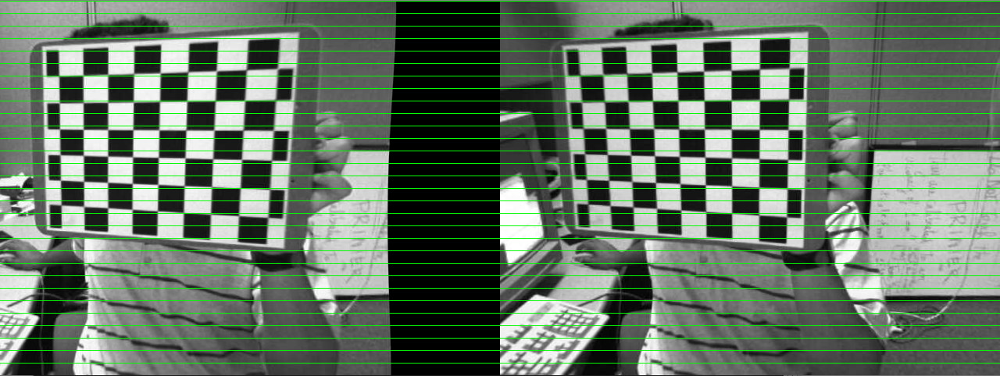
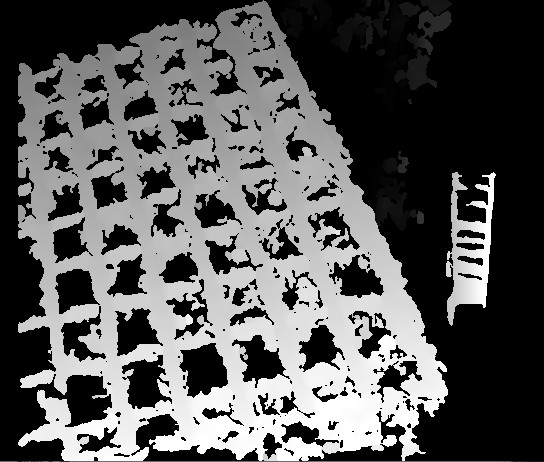

# StereoCalib运行

## 1-运行命令

### 1.1问题1:assertion failed

在网上搜索说是文件没有办法读取，所以要检查文件是否能够正常读取，查找一下发现roopath路径设置不对，修改之后的设置如下：

```c++
const char *board_list =  "D:/Files/Opencv/StereoCalib/StereoCalib/StereoCalib/stereoData/example_19-03_list.txt";
const char* roopath = "D:/Files/Opencv/StereoCalib/StereoCalib/StereoCalib/stereoData/";
	
```

### 1.2程序理解

​	`StereoCalib(board_list, board_w, board_h, true, roopath);`

​	其中的broad_w, broad_h我猜测是水平和竖直方向的角点设置，而不是方块的个数，所以是`broad_h=6`, `broad_w=9`

​	而书中说了，识别出来角点会在同一行的角点画出来同一个颜色，这也跟我们刚才的猜测是一致的，如下图:



​	最后显示出来的校正图像如下:



​	所以这个程序其实做了一样一个工作：先立体标定，然后得到立体校正，然后校正图像，得到输出标定图像理想行对准校正之后的图像。

​	另外还显示了一个视差图



关于视差图的介绍:https://blog.csdn.net/qq_15295565/article/details/105964662

其实介绍书籍的最后就是根据一个视差图和重投影得到深度图

https://blog.csdn.net/qq_15295565/article/details/105964662

本质上来说，视差和深度是呈现出反比.

### 1.3程序结构

程序流程图大致如下：

```flow
st=>start: 开始
op1=>operation: 读取标定图像组
op2=>operation: 寻找角点
op3=>operation: 设置标定点的世界坐标,注意，这里设置其世界坐标时，一般设置z坐标为0，x,y坐标与标定板平面相同，这里需要设置其方格尺寸
op3_1=>operation: 注意，这里设置其世界坐标时，一般设置z坐标为0，x,y坐标与标定板平面相同，这里需要设置其方格尺寸
op4=>operation: 立体标定,stereoCalib(),计算得到两个摄像机的内参矩阵,畸变参数，旋转与平移参数R、T,基础矩阵F和本征矩阵E
op4_1=>operation: 计算得到两个摄像机的内参矩阵,畸变参数，旋转与平移参数R、T,基础矩阵F和本征矩阵E
op5=>operation: 消除原始点畸变 cv::undistortPoints()
op6=>operation: 计算极线,cv::computeCorrespondEpilines()
op7=>operation: 计算点和极线的点乘，如果是理想状态为0
op8=>operation: 计算校正匹配图,uncalibrated (Hartley) method cv::stereoRectifyUncalibrated()或者(Bouguet) method cv::stereoRectify()
op8_1=>operation: uncalibrated (Hartley) method cv::stereoRectifyUncalibrated()或者(Bouguet) method cv::stereoRectify()
op9=>operation: 画出辅助参考线
e=>end: 结束

st->op1->op2->op3->op4->op5->op6->op7->op8->op9->e

```

## 2-读取多张标定图片

按照我之前链接上的程序:https://blog.csdn.net/qq_37761077/article/details/88756982

把每次截图的图片保存下来

读取双目并显示视屏的程序: https://blog.csdn.net/haikuotiankong7/article/details/77878892

读取图片的时候存在一个问题，就是读取下来的图片是我设置的大小，而不是原本的大小，这个会影响图像的标定结果吗?


