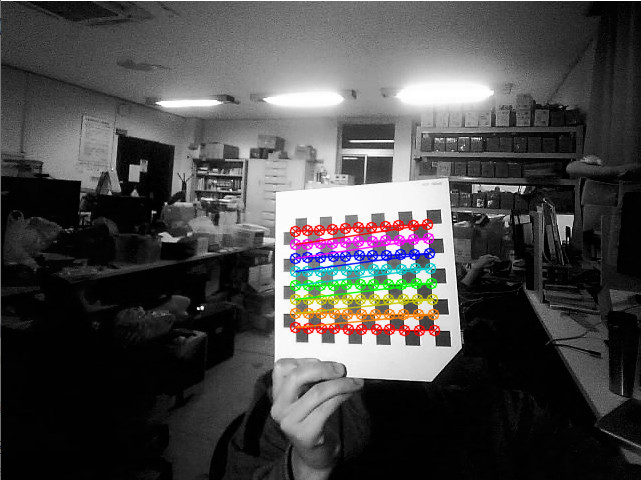
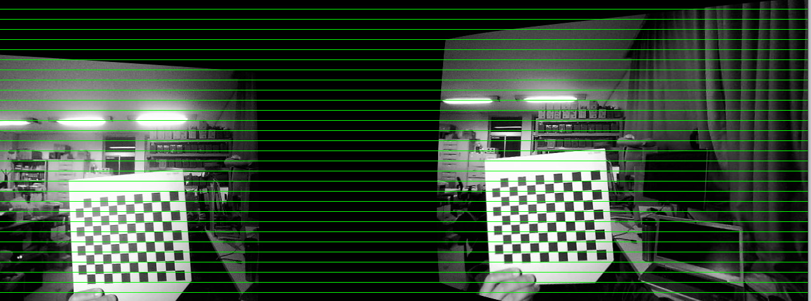
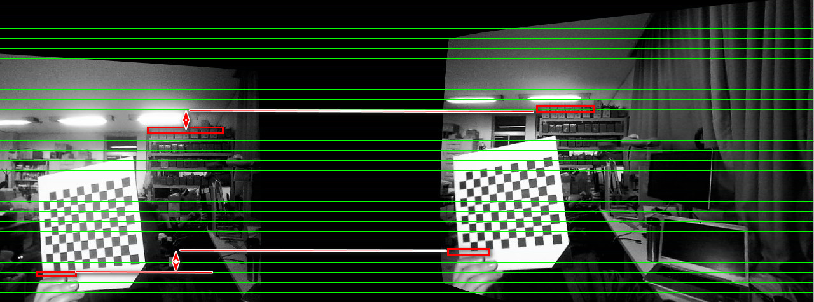
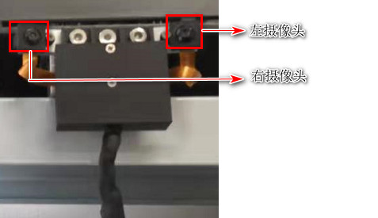
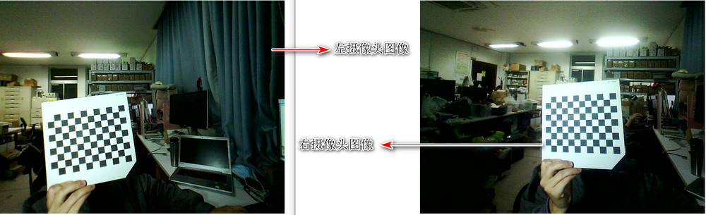
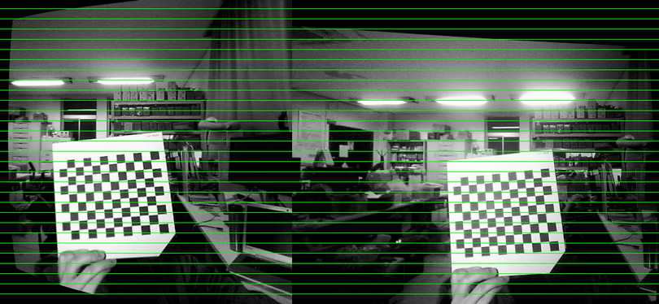
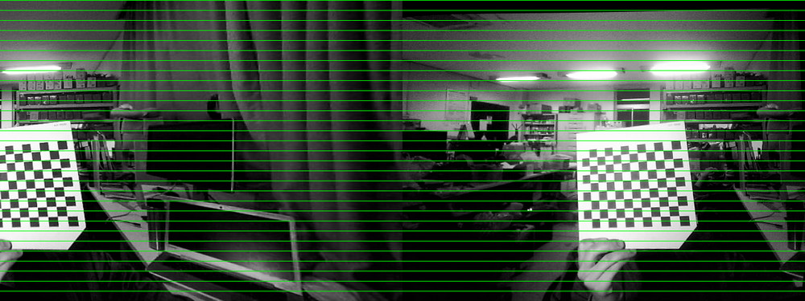

# StereoCalib运行

参考书籍:Learning OpenCV 3 computer vision in C++

初始例子代码: example_19_03

## 1-运行命令

### 1.1问题1:assertion failed

在网上搜索说是文件没有办法读取，所以要检查文件是否能够正常读取，查找一下发现roopath路径设置不对，修改之后的设置如下：

```c++
const char *board_list =  "D:/Files/Opencv/StereoCalib/StereoCalib/StereoCalib/stereoData/example_19-03_list.txt";
const char* roopath = "D:/Files/Opencv/StereoCalib/StereoCalib/StereoCalib/stereoData/";
	
```

### 1.2程序理解

​	`StereoCalib(board_list, board_w, board_h, true, roopath);`

​	其中的broad_w, broad_h我猜测是水平和竖直方向的角点设置，而不是方块的个数，所以是`broad_h=6`, `broad_w=9`

​	而书中说了，识别出来角点会在同一行的角点画出来同一个颜色，这也跟我们刚才的猜测是一致的，如下图:


​	最后显示出来的校正图像如下:


​	所以这个程序其实做了一样一个工作：先立体标定，然后得到立体校正，然后校正图像，得到输出标定图像理想行对准校正之后的图像。

​	另外还显示了一个视差图


关于视差图的介绍:https://blog.csdn.net/qq_15295565/article/details/105964662

其实介绍书籍的最后就是根据一个视差图和重投影得到深度图

https://blog.csdn.net/qq_15295565/article/details/105964662

本质上来说，视差和深度是呈现出反比.

### 1.3程序结构

程序流程图大致如下：

```flow
st=>start: 开始
op1=>operation: 读取标定图像组
op2=>operation: 寻找角点
op3=>operation: 设置标定点的世界坐标,注意，这里设置其世界坐标时，一般设置z坐标为0，x,y坐标与标定板平面相同，这里需要设置其方格尺寸
op3_1=>operation: 注意，这里设置其世界坐标时，一般设置z坐标为0，x,y坐标与标定板平面相同，这里需要设置其方格尺寸
op4=>operation: 立体标定,stereoCalib(),计算得到两个摄像机的内参矩阵,畸变参数，旋转与平移参数R、T,基础矩阵F和本征矩阵E
op4_1=>operation: 计算得到两个摄像机的内参矩阵,畸变参数，旋转与平移参数R、T,基础矩阵F和本征矩阵E
op5=>operation: 消除原始点畸变 cv::undistortPoints()
op6=>operation: 计算极线,cv::computeCorrespondEpilines()
op7=>operation: 计算点和极线的点乘，如果是理想状态为0
op8=>operation: 计算校正匹配图,uncalibrated (Hartley) method cv::stereoRectifyUncalibrated()或者(Bouguet) method cv::stereoRectify()
op8_1=>operation: uncalibrated (Hartley) method cv::stereoRectifyUncalibrated()或者(Bouguet) method cv::stereoRectify()
op9=>operation: 画出辅助参考线
e=>end: 结束

st->op1->op2->op3->op4->op5->op6->op7->op8->op9->e

```

## 2-读取多张标定图片

### 2-1标定板准备

​	准备一个标定板，方格为12X9，一个小方格为15mmX15mm

### 2-2读取保存标定图片

#### 2-2-1 读取保存

按照我之前链接上的程序:https://blog.csdn.net/qq_37761077/article/details/88756982

把每次截图的图片保存下来

读取双目并显示视屏的程序: https://blog.csdn.net/haikuotiankong7/article/details/77878892

其中图片大小设置为640X480

**Question 1 :** 读取图片的时候存在一个问题，就是读取下来的图片是我设置的大小，而**不是原本的大小**，这个会影响图像的标定结果吗?

#### 2-2-2设置image-list文件

​	image-list里面保存有图片名称，需要注意的一点是，在imagelist里面的left01.jpg和right01.jpg需要是相邻的，即**同一个视角的两个图片名称相邻**

## 3-标定自己的相机

### 3-1 设置路径为自己采样的图片路径

设置其中的image list路径与roopath路径

### 3-2设置标定板相关参数

board_w = 11;  	//每一行角点数目为11

board_h = 8;   	//每一列角点数目为8

squareSize= 15.f;  //方格大小设置为15mm

### 3-3程序运行结果

使用自己采集得到的图片运行第一部分的程序，得到的角点检测图形如下:





比较奇怪的是它没有行对准,差了很多,没有例程表现的好

好像是图像整体有两行错位了



看起来是左边的摄像头视野高一点，但是最后的校正图像反而是右边的高一点，是不是图像输出的时候反了呢.

### 3-4结果分析

出现上面的问题其实是我把摄像头弄反了，实际上因为摄像头安装倾斜，如下:



所以3-3部分的图像都是反的，实际上的对应左右摄像头的图像如下:



### 3-5重新运行



还是不对应，左边图像的位置比右边的要高一点,高两格

但是很奇怪的是，在原始图像里面，显示的是右边图像里面的物体比左边的高两格左右


**重点来了：**

上面3-5部分得到的结果其实是使用未标定方法(harley 算法)，其旨在最小化两幅立体图像的计算视差时将对极点映射到无穷远处的单应矩阵，可以通过匹配两幅图像之间的对应点完成，其出现的**问题**就是我上面说的，左边图像中的物体比右边的高

但是当我使用了标定方法Bouguet算法的时候，图像这个时候就正常了。如下图：



## 4参考链接


[1-立体视觉标定流程](https://blog.csdn.net/Crystal_YS/article/details/87716948)

[2-立体视觉校正与标定](https://blog.csdn.net/hellohake/article/details/104783751)

[3-相机的基线距](https://blog.csdn.net/Yong_Qi2015/article/details/82224620) 基线距大致和标定结果的T对比

[4-双目摄像头测距原理](https://zhuanlan.zhihu.com/p/75866447) 中有对基线距的定义，**基线**是两个摄像头光圈中心之间的距离